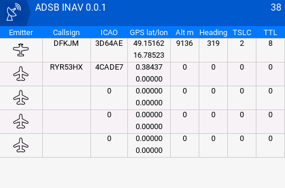

# ADSB_INAV

An application for displaying and receiving ADS-B data within the INAV environment.  
It visualizes nearby air traffic based on data. It needs to installed ADSB receiver on RC plane.

## Features
- Real-time aircraft display
- Communication support for common FPV protocols
- Simple user interface designed for INAV integration

## Important Information
- ❗ **Only color transmitters are supported** – black-and-white transmitters are **not supported**.
- ⚙️ **Supported protocols:**
    - **CRSF** (tested via ELRS) ELRS 3.6.0 or newer
    - **SmartPort** (untested)

## Installation
1. Download the latest release from [releases](https://github.com/error414/ADSB_INAV/releases).
2. Extract the archive and to transmitter SD card.

## License
This project is released under the MIT License.